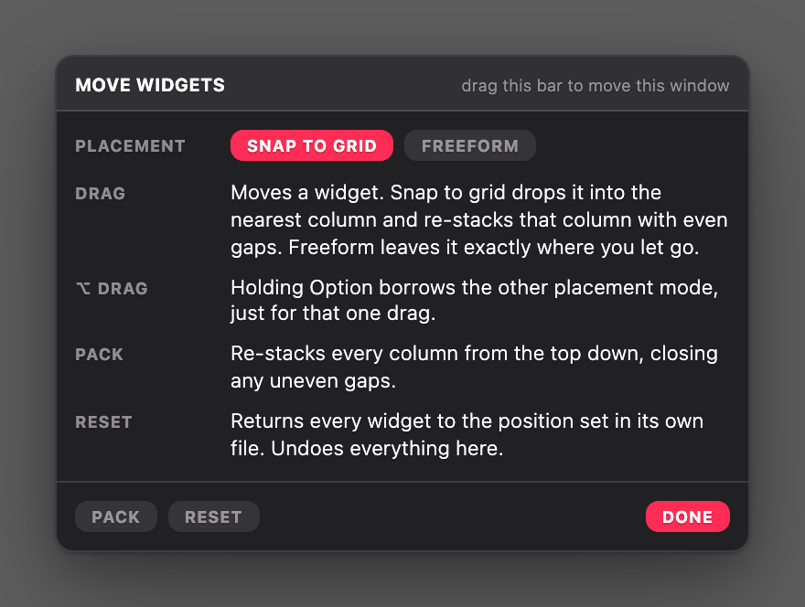
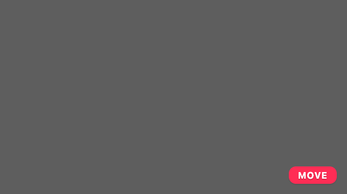

# Layout Controller

Move [Übersicht](http://tracesof.net/uebersicht) widgets around the desktop like
windows, and keep them where you put them.



Übersicht positions every widget absolutely from its own CSS, so rearranging your
desktop normally means editing files and reloading. This widget makes it direct: move
your pointer to the **bottom-right corner of the screen**, click **Move**, and drag
widgets where you want them. Positions persist across reloads, restarts and
refreshes, per screen.

It manages **any** widget, including third-party ones, with no changes on their part.
Widgets are found by Übersicht's own `.widget` class and keyed by DOM id, so
`index.coffee`, `index.jsx`, `index.js` and loose-file widgets all work.

## Install

Drop `layout-controller.widget` into your Übersicht widgets folder. There is nothing
to build and nothing to configure.

Saving positions uses `jq`, which ships with macOS. Without it the widget still drags
and packs, it just cannot persist; nothing is corrupted.

## Finding the Move button

**Move your pointer to the bottom-right corner of the screen.** That is the entire
interface when the desktop is locked: one small pill, 10px in from the bottom and
right edges.



It is invisible until your pointer gets close, deliberately, so it does not sit on
your wallpaper all day. There is a generous approach zone around it, so you do not
have to hit it precisely, just move into the corner and it fades in. Click it and the
move window below opens.

If you have a widget of your own parked in that corner, the pill sits above it at
`z-index: 9999`.

## Using it

| Control | What it does |
|---|---|
| **Move** | Bottom-right corner of the screen. Unlocks the desktop and opens the move window. The corner pill hides while unlocked, so there is only ever one place to click Done |
| **Drag** | Moves a widget |
| **⌥ Drag** | Borrows the other placement mode for that one drag |
| **Pack** | Re-stacks every column, closing uneven gaps. Each widget keeps the screen edge it was dropped nearest |
| **Reset** | Returns every widget to the position set in its own file, undoing everything |
| **Done** | Locks the desktop again |

The move window itself is draggable by its title bar, so it can be pushed out of the
way of whatever you are arranging.

### Placement modes

| Mode | Behaviour |
|---|---|
| **Snap to grid** (default) | A drop snaps to the nearest column and re-packs that column with even gaps |
| **Freeform** | The widget stays exactly where you let go, and nothing else moves |

The choice is remembered per screen, and holding **Option** during a drag borrows the
other mode just for that drop.

Horizontal snapping is exact, because widget widths are fixed: columns sit on a
330px pitch from a 10px origin. Vertically nothing snaps to a lattice. The column is
re-packed from each widget's *real measured height* plus a 10px gap, because a row
lattice cannot express a real desktop: top-lists render about 122px and a
contributions graph about 102px, neither a multiple of the 80px base unit.

### Anchoring

A widget stacks from the screen edge it was dropped nearest, so one column can hold a
group grown down from the top and another grown up from the bottom. Drop a widget low
and it stays low as its neighbours change height, which is what lets something written
to sit at the foot of the screen be managed at all instead of opting out.

The anchor is decided once, when you drop the widget, and remembered from then on. It
is deliberately not re-derived from where a widget ends up: packing moves widgets, and
moving one can change which edge it is nearest, so a derived anchor would never settle.

A widget can also declare a starting anchor with `data-layout-anchor` (below), which
covers the case where it has never been dragged. Dragging always wins over that.

When a column holds more than fits, the upward group gives way: a widget that would
cross the downward stack is placed against it instead, so the column degrades into one
continuous top-down run rather than into overlapping widgets.

## The grid

The default grid matches the one this widget's companion collection uses:

| Token | Value | Meaning |
|-------|-------|---------|
| `EDGE` | `10px` | Gap from the screen's top and left edges |
| `GAP` | `10px` | Gap between neighbours |
| `COL` | `320px` | Width of one column |
| `UNIT` | `80px` | Minimum widget height, one row |

Column left positions are `EDGE + col · (COL + GAP)`, so 10 / 340 / 670 / 1000 and so
on. Vertical placement accumulates `max(UNIT, realHeight) + GAP` from the widget's
anchor: `EDGE + Σ …` from the top for a top-anchored widget, and the mirror of that up
from `screenHeight - EDGE` for a bottom-anchored one. Retune all of it in the `grid`
option at the top of `index.coffee`.

## For other widget authors

The contract is entirely optional and goes in both directions. Any widget is managed
automatically without it.

### Telling the controller about your widget

Attributes on your widget's root element:

| Attribute | Meaning |
|---|---|
| `data-layout-manual` | Never manage me. This is how a widget declares that it positions itself, pinned to a corner or centred |
| `data-layout-span="2"` | I occupy 2 columns. Only needed when the footprint is wider than what gets painted, or when the widget is still empty the first time it is measured. Otherwise the span is derived from the measured width |
| `data-layout-anchor="bottom"` | Stack me up from the bottom of the screen rather than down from the top. For a widget written to sit at the foot of the screen: it can say so and still be managed, instead of opting out with `data-layout-manual`. Only a default, and ignored once the widget has been dragged |

Set them in `afterRender`:

```coffee
afterRender: (domEl) ->
  domEl.setAttribute('data-layout-manual', '')
```

Set an anchor the same way, from whatever option your widget already uses for its own
placement, so the two never disagree:

```coffee
afterRender: (domEl) ->
  domEl.setAttribute 'data-layout-anchor',
    if options.verticalPosition is 'bottom' then 'bottom' else 'top'
```

### Reading the grid from your widget

The controller publishes these on `:root`. Always use a fallback so your widget still
works when the controller is not installed:

| Custom property | Default |
|---|---|
| `--grid-origin` | `10px` |
| `--grid-gap` | `10px` |
| `--grid-unit` | `80px` |
| `--grid-col` | `320px` |
| `--grid-col-pitch` | `330px` |
| `--grid-columns` | whole columns that fit this screen |

So instead of hardcoding sizes:

```coffee
width: var(--grid-col, 320px)
min-height: calc(var(--grid-unit, 80px) * 2 + var(--grid-gap, 10px))
```

A canvas widget cannot inherit custom properties, so it has to resolve them in JS with
`getComputedStyle(document.documentElement).getPropertyValue('--grid-col')`.

## How it works

**Positions are published as a document-level `<style>` block, not as inline styles.**
Übersicht re-applies each widget's own compiled style on every refresh, which wipes
inline `top`/`left` within seconds for anything that refreshes quickly. A rule in
`document.head` keyed by the widget's DOM id survives that, and because CSS is
declarative it applies whenever the widget renders, so widget load order does not
matter.

**State lives at `~/.config/ubersicht/layout.json`, deliberately outside the widget
folder.** Übersicht watches its widgets folder, so writing state there would reload
every widget on every drag, and any loose `.coffee` file inside it loads as a
duplicate widget.

**That state is per screen:**

```json
{ "version": 2, "screens": { "3": { "positions": {}, "seen": [] } } }
```

Übersicht serves one page per screen at `/<screenId>/` and runs a separate copy of
every widget in each, so each copy of the controller owns one slice, keyed by the id
in its own URL. Screens differ in size and therefore in column count, and a widget
shown on two screens usually wants a different spot on each. Saves are a `jq`
read-modify-write of just that one slice, behind a lock, so two screens cannot erase
each other. Version 1 files, a single flat position map, are migrated on read.

**A slice is re-packed when the screen it was packed for changes size.** A saved position
is an absolute pixel pair, so it means nothing without the screen it was measured against,
and that changes under it: plug in a display, change resolution, close the lid. Nothing
stored is relative to the bottom edge, so a bottom-anchored widget would simply stay at
the old floor and strand itself mid-screen when the desktop grows. Each slice records the
viewport it was packed for, and a mismatch re-packs. That is checked on a resize, which is
what an existing page gets when its window is re-framed, and again on load, because a page
built for a screen *after* the change never sees a resize at all. A slice written before
the viewport was recorded has nothing to compare against and is left alone rather than
guessed at.

**A widget that renders nothing keeps its slot.** A hidden widget is invisible to a pack,
so without this the ones below it take its space: the Music widget hides itself whenever
nothing is playing, and would come back to find its neighbour had claimed the foot of the
column. Each saved position remembers the height it was packed at, so a widget can be
placed again without being measured, and a pair does not trade places every time a track
starts or stops. **Pack** ignores this and reclaims the space, which is the way out when a
widget is switched off for good.

**Automatic re-packs wait for the desktop to stop filling in.** Widgets arrive one at a
time as their shell commands finish, over several seconds on a cold start. Packing a
half-rendered desktop is destructive rather than merely early, since a column's order
comes from the tops it can measure and a widget that has not arrived holds no place. The
re-pack waits until the widget count comes back the same twice running.

## Options

At the top of [`index.coffee`](layout-controller.widget/index.coffee):

| Option | Default | Meaning |
|---|---|---|
| `widgetEnabled` | `true` | Turn the whole widget off |
| `grid` | `{ origin: 10, colPitch: 330, gap: 10, unit: 80 }` | The desktop grid |
| `snap` | `'column'` | Starting placement mode for a screen that has never been set. The window's toggle owns it after that |
| `offGrid` | `['theme-controller', 'layout-controller']` | Widgets that place themselves and must never be packed. Matched as id prefixes. Prefer `data-layout-manual` on the widget itself; this list is for widgets you cannot edit. Both defaults are control surfaces rather than dashboard content |

## Companion widgets

Part of a collection of Übersicht widgets that share this grid and a common panel
treatment:

- [Music](https://github.com/dionmunk/uebersicht-music)
- [Visualizer](https://github.com/dionmunk/uebersicht-visualizer)
- [Theme Controller](https://github.com/dionmunk/uebersicht-theme-controller)
- [Weather](https://github.com/dionmunk/uebersicht-weather)
- [News](https://github.com/dionmunk/uebersicht-news)
- [CPU](https://github.com/dionmunk/uebersicht-cpu-usage) ·
  [Memory](https://github.com/dionmunk/uebersicht-memory-usage) ·
  [Storage](https://github.com/dionmunk/uebersicht-storage-usage) ·
  [Network](https://github.com/dionmunk/uebersicht-network-throughput)
- [GitHub Contributions](https://github.com/dionmunk/uebersicht-github-contributions)

## License

[CC BY-NC 4.0](LICENSE)
